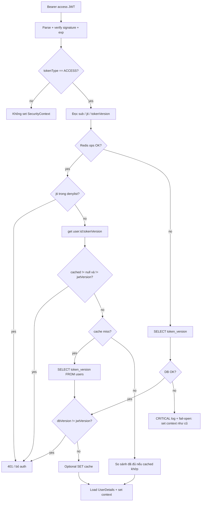

# Access token revocation (Redis + DB + fail-open)

## Hiện trạng (điểm chạm chính)

- `[JwtAuthFilter.java](d:\code\exotic_stamp\src\main\java\metro\ExoticStamp\modules\auth\infrastructure\filter\JwtAuthFilter.java)`: chỉ `extractUserId` + `isTokenValid`, không kiểm tra thu hồi server-side.
- `[JwtProvider.java](d:\code\exotic_stamp\src\main\java\metro\ExoticStamp\modules\auth\infrastructure\jwt\JwtProvider.java)`: access JWT có `sub`, `roles`, `tokenType=ACCESS`, **chưa** có `jti` / `tokenVersion`.
- `[AuthCommandService.java](d:\code\exotic_stamp\src\main\java\metro\ExoticStamp\modules\auth\application\AuthCommandService.java)`: `resetPassword` / `refresh` / `logout` / `logoutAll` đã revoke refresh (DB + `[RefreshTokenRedisRepository](d:\code\exotic_stamp\src\main\java\metro\ExoticStamp\modules\auth\infrastructure\redis\RefreshTokenRedisRepository.java)`); **access token cũ vẫn dùng được đến hết `exp`**.
- `[User.java](d:\code\exotic_stamp\src\main\java\metro\ExoticStamp\modules\user\domain\model\User.java)`: chưa có trường phiên bản token.
- Dev dùng `ddl-auto: validate` + Flyway — mọi thay đổi schema cần migration SQL mới (ví dụ `V7__...sql`).

## Thiết kế đa thiết bị vs spec nguyên văn

Spec của bạn ghi **mọi** sự kiện (logout, refresh, password reset) đều **tăng `token_version` toàn user** → mỗi lần refresh/logout một thiết bị sẽ **hủy access token của mọi thiết bị** cùng user. Điều này khớp “bảo mật tối đa” nhưng **trái** mục tiêu “multi-device strategy” trong acceptance criteria.

**Đề xuất triển khai (khuyến nghị):**

| Sự kiện                                   | Hành vi                                                                                                                                                    |
| ----------------------------------------- | ---------------------------------------------------------------------------------------------------------------------------------------------------------- |
| Password reset, `logoutAll`, reuse attack | `token_version++` (DB) + `SET user:{id}:tokenVersion` (hoặc `DEL` để ép đọc lại DB ở request sau)                                                          |
| Refresh                                   | **Không** tăng global version; **denylist `jti` của access token trước** của *đúng device* (đọc từ Redis slot trước khi cấp access mới)                    |
| Logout (một device)                       | **Denylist `jti`** của access token lấy từ header `Authorization` (endpoint đã authenticated) + revoke refresh như hiện tại; **không** bump global version |

Nếu bạn muốn **đúng 100%** đoạn spec “mọi trigger đều increment”, có thể đổi bảng trên (đơn giản hơn code nhưng cắt mọi phiên access song song).

## Luồng xác thực trong `JwtAuthFilter`

**Chi tiết quan trọng:**

- **Cache-aside:** Khi Redis “sống” nhưng key `user:{userId}:tokenVersion` **miss**, vẫn phải đọc DB rồi so sánh; sau đó `SET` cache để request sau nhanh. Chỉ dựa vào “cached != null” sẽ sai sau khi bump version nếu key bị xóa.
- **Denylist:** Chỉ kiểm tra khi Redis trả lời được; nếu Redis lỗi, không có nguồn denylist trong DB theo spec hiện tại → chấp nhận cửa sổ an toàn thu hẹp (log cảnh báo). Đây là trade-off availability; có thể bổ sung bảng denylist DB sau nếu cần fail-safe.
- **Fail-open:** Chỉ khi **đọc `token_version` từ DB thất bại** (timeout/connection) sau khi Redis không dùng được (hoặc đã fallback và DB cũng lỗi). Log mức ERROR/WARN + metric (ví dụ Micrometer counter) để cảnh báo.
- **Chỉ chấp nhận access token:** Kiểm tra claim `tokenType == ACCESS` trong filter để tránh dùng refresh JWT như access (hiện giờ chưa chặn).

## Thay đổi schema & domain

1. **Flyway:** file mới ví dụ `[src/main/resources/db/migration/V7__user_token_version.sql](d:\code\exotic_stamp\src\main\resources\db\migration\V7__user_token_version.sql)`:
  - `ALTER TABLE users ADD COLUMN IF NOT EXISTS token_version BIGINT NOT NULL DEFAULT 0;` (hoặc `INTEGER` nếu team chuẩn hóa nhỏ hơn).
2. **Entity `[User](d:\code\exotic_stamp\src\main\java\metro\ExoticStamp\modules\user\domain\model\User.java)`:** field `long tokenVersion` (map `token_version`), default 0 cho entity mới.
3. **Repository:** Trên `[JpaUserRepository](d:\code\exotic_stamp\src\main\java\metro\ExoticStamp\modules\user\infrastructure\persistence\JpaUserRepository.java)` + adapter `[UserRepository](d:\code\exotic_stamp\src\main\java\metro\ExoticStamp\modules\user\domain\repository\UserRepository.java)`:
  - Query nhẹ: `SELECT token_version FROM users WHERE id = :id` (projection hoặc `@Query`).
  - Cập nhật tăng bản: `@Modifying` `UPDATE users SET token_version = token_version + 1 WHERE id = :id` (và sau đó đọc lại version **hoặc** một câu native `UPDATE ... RETURNING token_version` để một round-trip — tùy preference).

## JWT (`[JwtProvider](d:\code\exotic_stamp\src\main\java\metro\ExoticStamp\modules\auth\infrastructure\jwt\JwtProvider.java)`)

- Khi tạo access token: `.id(UUID.randomUUID().toString())` (claim `jti` trong jjwt 0.12), `.claim("tokenVersion", user.getTokenVersion())` (đồng bộ kiểu `Long`/`Integer` với DB).
- Thêm API kiểu `parseAccessToken(String)` trả về `Claims` hoặc DTO đã validate `tokenType == ACCESS`, hoặc các method `getTokenVersion`, `getJti` — filter/service chỉ parse **một lần** mỗi request để giảm chi phí.

**Lưu ý triển khai:** Mọi access token đã phát hành trước khi deploy **sẽ thiếu** `jti`/`tokenVersion` → nên coi là không hợp lệ (401) sau go-live; thông báo client cần login lại.

## Redis (mở rộng pattern `[RedisKeyValueSupport](d:\code\exotic_stamp\src\main\java\metro\ExoticStamp\infra\redis\RedisKeyValueSupport.java)`)

Repository mới trong `modules/auth/infrastructure/redis/` (có thể gộp một class hoặc tách hai):

- **Version cache:** key `user:{userId}:tokenVersion` — giá trị số; TTL có thể = `jwt.access-token-ttl` (thêm property trong `[CacheProperties](d:\code\exotic_stamp\src\main\java\metro\ExoticStamp\config\CacheProperties.java)` hoặc tái dùng `JwtProperties`) hoặc không TTL nếu luôn `SET` khi bump (đơn giản, Redis chỉ là cache).
- **Denylist:** key `denylist:{jti}` — value bất kỳ (ví dụ `"1"`), **TTL = access token TTL** (`[JwtProperties.getAccessTokenTtl()](d:\code\exotic_stamp\src\main\java\metro\ExoticStamp\modules\auth\infrastructure\jwt\JwtProperties.java)`).
- **Slot access jti theo device (cho refresh):** ví dụ `auth:access_jti:{userId}:{deviceFingerprint}` → lưu `jti` hiện tại, TTL ≥ refresh TTL (đồng bộ `[CacheProperties.getRefreshTokenTtl()](d:\code\exotic_stamp\src\main\java\metro\ExoticStamp\config\CacheProperties.java)`) để biết access nào cần denylist khi rotate.

Có thể thêm helper trên `RedisKeyValueSupport` nếu thiếu (ví dụ `setWithTtl` đã có qua `putValue`).

## Tích hợp `[AuthCommandService](d:\code\exotic_stamp\src\main\java\metro\ExoticStamp\modules\auth\application\AuthCommandService.java)` + `[AuthController](d:\code\exotic_stamp\src\main\java\metro\ExoticStamp\modules\auth\presentation\AuthController.java)`

- **Login:** Sau khi có access JWT, ghi slot `auth:access_jti:{userId}:{deviceFp}` = `jti` mới. Bump cache version không cần nếu không đổi DB (chỉ cần đảm bảo JWT mang đúng `tokenVersion` từ user).
- **Refresh:** Trước khi phát access mới: đọc jti cũ từ slot → `SET denylist:{oldJti}` (TTL access) → phát access mới → cập nhật slot jti mới. Transaction: thứ tự và idempotency cần cẩn thận (nếu refresh lặp, chỉ denylist một lần).
- **Reset password / logoutAll / reuse:** `token_version++` trong DB; `SET user:{id}:tokenVersion` = giá trị mới (hoặc `DEL` key cache); giữ nguyên revoke refresh hiện có.
- **Logout một thiết bị:** Truyền từ controller chuỗi Bearer access (hoặc `jti` đã parse) vào service → `SET denylist:{jti}` TTL access; không bump global version (theo bảng khuyến nghị).

## `JwtAuthFilter` — dependency

- Inject service/port kiểm tra thu hồi (tránh đặt quá nhiều logic Redis/JPA trong filter): ví dụ `AccessTokenRevocationValidator` nhận `userId`, `jti`, `tokenVersion`, và optional `Duration` TTL không cần thiết cho filter.
- Filter: nếu pipeline báo “revoked / version mismatch” → **không** set `SecurityContext` (giữ hành vi hiện tại là request tiếp tục như anonymous; các API protected sẽ 401 qua entry point — có thể cân nhắc response rõ ràng hơn sau này).

## Kiểm thử & vận hành

- Unit test `JwtProvider` (claims).
- Integration test filter: version khớp / bump sau reset / denylist có jti / mock Redis down → DB path / DB down → fail-open (log).
- Cập nhật `[docs/WAITING_UPDATE_FEATURES.md](d:\code\exotic_stamp\docs\WAITING_UPDATE_FEATURES.md)` mục 1: **Current state** → đã có server-side invalidation (optional, nếu bạn muốn giữ doc đồng bộ).

## Rủi ro

- Bump version + cache miss phải luôn đọc DB — tải DB tăng nhẹ; có thể metric `cache.hit` cho key version.
- Go-live: toàn bộ client cần token mới.

