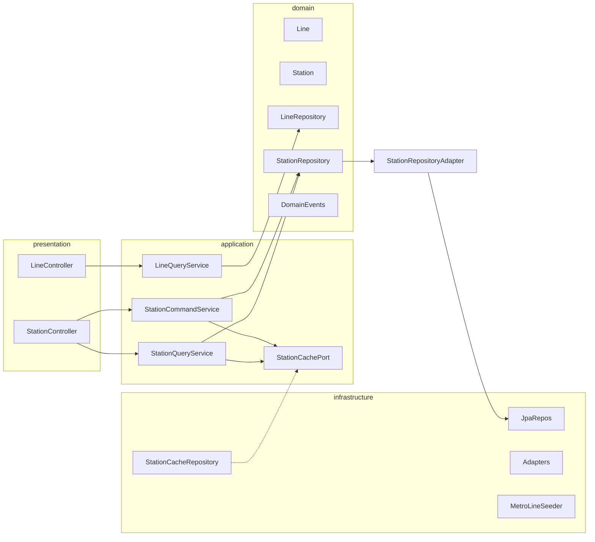

# Metro module DDD / Shared Kernel compliance

## Current state (findings)

- Layering is partially there: `[LineRepository](d:\code\exotic_stamp\src\main\java\metro\ExoticStamp\modules\metro\domain\repository\LineRepository.java)` / `[StationRepository](d:\code\exotic_stamp\src\main\java\metro\ExoticStamp\modules\metro\domain\repository\StationRepository.java)` are domain ports; `[LineRepositoryAdapter](d:\code\exotic_stamp\src\main\java\metro\ExoticStamp\modules\metro\infrastructure\persistence\LineRepositoryAdapter.java)` / `[StationRepositoryAdapter](d:\code\exotic_stamp\src\main\java\metro\ExoticStamp\modules\metro\infrastructure\persistence\StationRepositoryAdapter.java)` exist.
- `[MetroQueryService](d:\code\exotic_stamp\src\main\java\metro\ExoticStamp\modules\metro\application\MetroQueryService.java)` depends directly on `[StationScanCacheRepository](d:\code\exotic_stamp\src\main\java\metro\ExoticStamp\modules\metro\infrastructure\cache\StationScanCacheRepository.java)` (infra) — violates “app depends on port” rule.
- `[SecurityConfig](d:\code\exotic_stamp\src\main\java\metro\ExoticStamp\config\SecurityConfig.java)` only permits auth/swagger paths; **all metro GETs currently require authentication** (contradicts “public read” — tests even use `@WithMockUser`).
- `[StationResponse](d:\code\exotic_stamp\src\main\java\metro\ExoticStamp\modules\metro\presentation\dto\response\StationResponse.java)` exposes `nfcTagId` and `qrCodeToken` — violates data exposure rules for summaries.
- `[V2__metro.sql](d:\code\exotic_stamp\src\main\resources\db\migration\V2__metro.sql)` has no `UNIQUE (line_id, sequence)` — requirement **#1** needs DB + repository support.
- `[AdminMetroService#createStation](d:\code\exotic_stamp\src\main\java\metro\ExoticStamp\modules\metro\application\AdminMetroService.java)` always `bumpLineTotalStations(+1)` even when `isActive` is false; `toggleStationStatus` does not adjust `Line.totalStations` — conflicts with **totalStations tracks ACTIVE** rule.
- `[BaseCacheRepository](d:\code\exotic_stamp\src\main\java\metro\ExoticStamp\infra\cache\BaseCacheRepository.java)` is UUID-keyed; metro needs string keys `station:nfc:*` / `station:qr:*`. **Do not change** `BaseCacheRepository` API; subclass extends it for `prefix()` / `ttl()` / `type()` / metrics and **add** string-key get/put/evict methods in the subclass (same pattern as today’s `StationScanCacheRepository`, still extending `BaseCacheRepository<StationDetailResponse>` per contract).
- After-commit pattern already exists: `[RbacTransactionCallbacks.afterCommit](d:\code\exotic_stamp\src\main\java\metro\ExoticStamp\modules\rbac\application\support\RbacTransactionCallbacks.java)` — reuse for QR rotate event publication.

## Target architecture

## 1. Package structure and class mapping

| Requirement   | Action                                                                                                                                                                                                                                                                                                                                                                                                                                                                                                                                                        |
| ------------- | ------------------------------------------------------------------------------------------------------------------------------------------------------------------------------------------------------------------------------------------------------------------------------------------------------------------------------------------------------------------------------------------------------------------------------------------------------------------------------------------------------------------------------------------------------------- |
| Split queries | Replace `[MetroQueryService](d:\code\exotic_stamp\src\main\java\metro\ExoticStamp\modules\metro\application\MetroQueryService.java)` with `**LineQueryService**` + `**StationQueryService**` (`@Transactional(readOnly = true)`).                                                                                                                                                                                                                                                                                                                             |
| Commands      | Move write logic from `[AdminMetroService](d:\code\exotic_stamp\src\main\java\metro\ExoticStamp\modules\metro\application\AdminMetroService.java)` into `**StationCommandService**` (`@Transactional`) + thin line create/update helpers (either same class or small private delegation — prefer `**LineCommandService**` only if needed; contract lists Line POST/PUT only — can live in `StationCommandService` or dedicated `LineCommandService`; **minimal**: `LineCommandService` for line mutations, `StationCommandService` for stations to keep SRP). |
| Port          | Add `**application/port/StationCachePort.java**` with: `Optional<StationDetailResponse> getByNfcTagId`, `getByQrToken`, `putByStationId` (detail cache), `evictByNfcTagId`, `evictByQrToken`, `evictDetailByStationId` (or align naming with contract — contract lists four evict/get variants; include detail eviction as needed for admin updates).                                                                                                                                                                                                         |
| Cache infra   | Rename/refactor `**StationScanCacheRepository` → `StationCacheRepository**`: `extends BaseCacheRepository<StationDetailResponse>`, `implements StationCachePort`, `prefix()` → `"station:"`, TTL ≥ 30m for NFC/QR/detail (align `[CacheProperties](d:\code\exotic_stamp\src\main\java\metro\ExoticStamp\config\CacheProperties.java)`: set `metroStationScan` default to **≥ 1800s** if currently 300s).                                                                                                                                                      |
| Controllers   | Add `**LineController**` + `**StationController**` at `/api/v1/lines` and `/api/v1/stations`; delete or empty `**MetroController**` / `**AdminMetroController**` after migration.                                                                                                                                                                                                                                                                                                                                                                             |
| Domain events | Add records/classes under `**domain/event/**`: `StationActivatedEvent`, `StationDeactivatedEvent`, `StationQrRotatedEvent` (fields: `stationId`, relevant old/new tokens as needed).                                                                                                                                                                                                                                                                                                                                                                          |

## 2. DTOs

- **Summary**: `[StationResponse](d:\code\exotic_stamp\src\main\java\metro\ExoticStamp\modules\metro\presentation\dto\response\StationResponse.java)` — **remove** `nfcTagId`, `qrCodeToken` (and any other sensitive fields per policy). Used for lists and line-nested stations.
- **Detail**: New `**StationDetailResponse**` — full fields for GET by id / cache (still **omit** echoing secrets on NFC/QR **lookup responses** if contract implies minimization — at minimum, summaries/lists must not expose them; detail-by-id can expose only non-sensitive fields publicly; admin responses can use separate admin DTO or flags — **minimal**: public detail = same as summary + optional extras **without** nfc/qr; admin update responses can include identifiers when needed).
- **Line detail**: Extend response for **GET `/api/v1/lines/{id}**` to include `**List<StationResponse>**` summaries (new `**LineDetailResponse**` or extend `[LineResponse](d:\code\exotic_stamp\src\main\java\metro\ExoticStamp\modules\metro\presentation\dto\response\LineResponse.java)` with `stations` field — prefer `**LineDetailResponse**` wrapping line + stations for clarity).
- Requests: add `**RotateQrTokenRequest**`; ensure `**CreateStationRequest**` includes `**lineId**` (required for `POST /api/v1/stations`). Deprecate/remove path-based create (`UpdateNfcRequest` / `UpdateQrRequest` / `ToggleStatusRequest` replaced by activate/deactivate/rotate-qr + `UpdateStationRequest` as appropriate).

## 3. API surface (behavioral mapping)

| New endpoint                        | Notes                                                                                                                                                                                                                                                                                                           |
| ----------------------------------- | --------------------------------------------------------------------------------------------------------------------------------------------------------------------------------------------------------------------------------------------------------------------------------------------------------------- |
| `GET /api/v1/lines`                 | Public; preserve `activeOnly` query if desired.                                                                                                                                                                                                                                                                 |
| `GET /api/v1/lines/{id}`            | Public; **includes station summaries** (new query method joining line + stations).                                                                                                                                                                                                                              |
| `POST/PUT /api/v1/lines`            | `ADMIN` only.                                                                                                                                                                                                                                                                                                   |
| `GET /api/v1/stations?lineId=`      | Public; optional filter.                                                                                                                                                                                                                                                                                        |
| `GET /api/v1/stations/{id}`         | Public; returns **detail** DTO; **cache by id** via port (detail key under `station:detail:{id}` or merge into prefix scheme — keep consistent with graceful Redis).                                                                                                                                            |
| `GET .../stations/nfc/{nfcTagId}`   | Public; **cached**; returns appropriate DTO **without** treating inactive as 404 if current code throws — preserve existing `[StationInactiveException](d:\code\exotic_stamp\src\main\java\metro\ExoticStamp\modules\metro\domain\exception\StationInactiveException.java)` behavior unless contract conflicts. |
| `GET .../stations/qr/{qrToken}`     | Same.                                                                                                                                                                                                                                                                                                           |
| `POST/PUT /api/v1/stations`         | `ADMIN`.                                                                                                                                                                                                                                                                                                        |
| `PATCH .../activate` / `deactivate` | `ADMIN`; adjust `Line.totalStations`; publish events **after commit**.                                                                                                                                                                                                                                          |
| `PATCH .../rotate-qr`               | `ADMIN`; body `RotateQrTokenRequest`; **evict old QR key**; publish `StationQrRotatedEvent` **after commit** via `RbacTransactionCallbacks.afterCommit` + `ApplicationEventPublisher`.                                                                                                                          |
| `PATCH .../collector-count`         | `**hasAuthority('INTERNAL')**` (or `INTERNAL` permission seeded in DB); **increment only** (`collectorCount += delta` with positive delta or fixed +1).                                                                                                                                                         |

**Non-contract admin features** (image upload, station stats, line status toggle, soft delete): **keep** if still required by product, under same controllers with `ADMIN` and updated paths, or document removal if unused — default **keep** with `@PreAuthorize` to avoid breaking behavior.

## 4. Domain / application rules

- **Sequence per line**: Add `StationRepository.existsByLineIdAndSequence` / `...AndIdNot`; validate in `StationCommandService` before save; add Flyway `**V9__metro_station_sequence_unique.sql**`: `UNIQUE (line_id, sequence)` (nullable-safe — sequence is NOT NULL, OK).
- **NFC / QR uniqueness**: Already enforced via DB + existing checks.
- `**Line.totalStations**`: Centralize helper methods used by create, activate, deactivate, update (when `isActive` flips), and soft-delete; **only count ACTIVE** transitions (+1 on create-if-active or activate; -1 on deactivate or delete-if-active).
- `**collectorCount**`: New command method; **no** stamp-table recalculation.
- **Events**: Publish `StationActivatedEvent` / `StationDeactivatedEvent` on successful state transitions (after commit). **QR rotated** must be **after commit** only.

## 5. Security

- Update `[SecurityConfig](d:\code\exotic_stamp\src\main\java\metro\ExoticStamp\config\SecurityConfig.java)`: `permitAll` for `**HttpMethod.GET**` on `/api/v1/lines/**` and `/api/v1/stations/**` (narrow enough to exclude mutating verbs).
- New migration: insert permission `**INTERNAL**` (and optionally assign to a system user is out of scope — document that assignees get authority via `role_permissions`). Use `@PreAuthorize("hasAuthority('INTERNAL')")` on collector endpoint (`[JwtAuthFilter](d:\code\exotic_stamp\src\main\java\metro\ExoticStamp\modules\auth\infrastructure\filter\JwtAuthFilter.java)` already loads permission codes).
- Admin endpoints: class-level or method-level `@PreAuthorize("hasRole('ADMIN')")` on mutating line/station handlers.

## 6. Seeder

- Implement `[MetroLineSeeder](d:\code\exotic_stamp\src\main\java\metro\ExoticStamp\modules\metro\infrastructure\seeder\MetroLineSeeder.java)`: `CommandLineRunner`, `**@Order**` or conditional on data source; use `LineRepository.existsByCode("M1")` / station checks; insert M1 + **14** stations with sequence, lat/long, `nfcTagId`, `qrCodeToken`; log inserted vs skipped; **idempotent**.

## 7. Tests and wiring

- Update `[MetroControllerTest](d:\code\exotic_stamp\src\test\java\metro\ExoticStamp\modules\metro\presentation\MetroControllerTest.java)` / `[AdminMetroControllerTest](d:\code\exotic_stamp\src\test\java\metro\ExoticStamp\modules\metro\presentation\AdminMetroControllerTest.java)` for new controllers/paths; add `**@WebMvcTest**` cases: public GET **without** `@WithMockUser` where applicable; INTERNAL endpoint with mocked authority.
- Update `[MetroQueryServiceTest](d:\code\exotic_stamp\src\test\java\metro\ExoticStamp\modules\metro\application\MetroQueryServiceTest.java)` → split/rename to `LineQueryServiceTest` / `StationQueryServiceTest`; mock `**StationCachePort**`.
- Add unit test for `**StationCommandService**`: `totalStations` transitions + **after-commit** QR event (mock `TransactionSynchronizationManager` or integration test with `@Transactional`).

## 8. Cleanup

- Remove dead code paths: old `MetroController`, `AdminMetroController`, `MetroQueryService`, `AdminMetroService`, `StationScanCacheRepository` after cutover.
- Grep for `/api/v1/metro` and `/api/v1/admin/metro` in codebase and docs; update any references.

## Key files

| Area         | Files                                                                                                                                              |
| ------------ | -------------------------------------------------------------------------------------------------------------------------------------------------- |
| Security     | `[SecurityConfig.java](d:\code\exotic_stamp\src\main\java\metro\ExoticStamp\config\SecurityConfig.java)`, new migration for `INTERNAL` permission  |
| DB           | New `V9__metro_station_sequence_unique.sql`, optional index                                                                                        |
| Metro module | All under `[modules/metro](d:\code\exotic_stamp\src\main\java\metro\ExoticStamp\modules\metro)` per contract tree                                  |
| Config       | `[CacheProperties](d:\code\exotic_stamp\src\main\java\metro\ExoticStamp\config\CacheProperties.java)` / `application.yml` TTL for metro scan ≥ 30m |

## Validation checklist (for final PASS/FAIL)

- Compile + tests green (`mvn -q test` / `mvn -q -DskipTests compile`).
- No duplicate Spring mappings for same method/path.
- Public GET lines/stations work **without** JWT; admin PATCH/POST require auth + role.
- `Line.totalStations` matches ACTIVE count rules after create/activate/deactivate.
- QR rotate publishes event only after commit; old QR cache evicted.
- `StationCachePort` injected in application layer; implementation is `StationCacheRepository` only.

