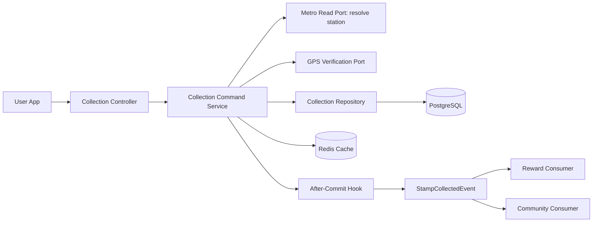
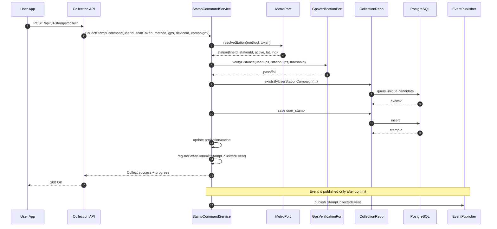

# Collection Module: Production-Ready End-to-End Workflow

## 1. Purpose

This document defines the standard, production-ready flow for the `collection` module in Exotic Stamp.

It is designed to be used as:
- implementation context for engineering agents,
- validation checklist for architecture/QA/security review,
- a handoff reference between backend, mobile/web client, and operations.

## 2. Scope and Boundaries

### 2.1 What `collection` owns

- Stamp collection command flow (`collect stamp`).
- Stamp book and collection progress read models.
- Campaign/stamp-design operational management (admin-facing).
- Domain event emission after successful collection commit.

### 2.2 What `collection` does not own

- Station source-of-truth and scan token mapping: owned by `metro`.
- Authentication and identity: owned by `auth`.
- Role/permission model: owned by `rbac`.
- Milestone evaluation and voucher issuance: owned by `reward` (consumer side).
- Referral/share growth logic: owned by `community` (consumer side).

## 3. Required Feature Set (Definition of Complete)

The module is considered production-ready only when all groups below are implemented:

1. User-facing APIs:
- `POST /api/v1/stamps/collect`
- `GET /api/v1/stamps/book`
- `GET /api/v1/stamps/history` (recommended for profile/activity feeds)

2. Admin-facing APIs:
- campaign CRUD + status toggle
- assign/remove station from campaign
- stamp design CRUD + status toggle
- collection stats endpoints for operations

3. Core domain safeguards:
- GPS verification
- anti-duplicate + idempotency
- campaign-time validation
- race-condition safety at DB layer (unique constraint)

4. Integration guarantees:
- event emission only after DB commit
- stable event payload contract for downstream consumers (`reward`, `community`)

5. Operational readiness:
- metrics/logging/alerts
- security and RBAC hardening
- integration and E2E test coverage

## 4. Data and Rules Baseline

Based on the schema design, `user_stamps` is the source of truth for collection.

Critical invariant:
- A user can collect only once for the same `(user_id, station_id, campaign_id)`.
- For permanent stamps (`campaign_id = NULL`), uniqueness must still hold.

Suggested enforced rules:
- scan method must be valid (`NFC` or `QR`).
- station must be active.
- campaign must be active and inside time window.
- GPS must pass distance threshold (example: 200m).
- failed validations must return deterministic domain errors.

## 5. End-to-End Runtime Flow

### 5.1 High-level architecture flow

### 5.2 Collect Stamp command flow

### 5.3 Stamp Book read flow

1. Client requests stamp book by user and context (`lineId` and/or `campaignId`).
2. Query service loads:
- station reference set from metro domain data,
- collected records from `user_stamps`.
3. Service builds response projection:
- total stations,
- collected stations,
- percentage progress,
- collected timestamps (if available).
4. Result is cached by user-context key.
5. Cache is evicted or refreshed when collect succeeds.

## 6. Admin Workflow (Operations)

### 6.1 Campaign lifecycle

1. Create campaign in `DRAFT` or inactive state.
2. Assign stations to campaign.
3. Attach stamp designs for station/campaign combinations.
4. Activate campaign only when:
- date window is valid,
- station assignments are complete,
- required assets are available.
5. Deactivate/close campaign when event period ends or incident occurs.

### 6.2 Recommended admin API surface

- `POST /api/v1/admin/collection/campaigns`
- `PUT /api/v1/admin/collection/campaigns/{id}`
- `PATCH /api/v1/admin/collection/campaigns/{id}/status`
- `POST /api/v1/admin/collection/campaigns/{id}/stations`
- `DELETE /api/v1/admin/collection/campaigns/{id}/stations/{stationId}`
- `POST /api/v1/admin/collection/stamp-designs`
- `PUT /api/v1/admin/collection/stamp-designs/{id}`
- `PATCH /api/v1/admin/collection/stamp-designs/{id}/status`
- `GET /api/v1/admin/collection/stats`

## 7. Security and Authorization

1. User endpoints require authenticated JWT.
2. Admin endpoints require:
- `ROLE_ADMIN`, and
- domain permission such as `COLLECTION_ADMIN` for fine-grained control.
3. Sensitive admin actions should be audit-logged:
- campaign status changes,
- station assignment changes,
- stamp design activation/deactivation.

## 8. Error Contract (Deterministic)

Minimum domain-level errors:
- `STATION_NOT_FOUND`
- `STATION_INACTIVE`
- `INVALID_SCAN_METHOD`
- `GPS_VERIFICATION_FAILED`
- `CAMPAIGN_NOT_FOUND`
- `CAMPAIGN_NOT_ACTIVE`
- `STAMP_ALREADY_COLLECTED`

Guideline:
- map errors consistently through global exception handling,
- preserve stable error codes for client retry/UI logic.

## 9. Reliability and Performance Guardrails

1. DB uniqueness is final protection against race conditions.
2. Use transaction boundaries around collect write path.
3. Publish domain events only in after-commit hooks.
4. Cache-aside for read-heavy stamp book queries.
5. Keep hot-path indexes for:
- scan lookup (metro side),
- user stamp timeline (`user_id`, `collected_at`),
- campaign queries.
6. For event delivery:
- retries + dead-letter strategy,
- idempotent consumer behavior in downstream modules.

## 10. Observability (Must Have)

Track at least:
- collect request count,
- collect success/failure rate,
- duplicate rejection rate,
- GPS verification failure rate,
- P95/P99 latency of collect endpoint,
- event publish success/failure count,
- consumer lag (reward/community).

Operational alerts:
- spike in collect failures,
- elevated GPS failures,
- event bus publish errors,
- consumer lag threshold exceeded.

## 11. Testing Matrix (Go-Live Gate)

1. Unit tests:
- GPS threshold logic,
- campaign window validation,
- duplicate rule logic.

2. Integration tests:
- DB unique constraint behavior,
- rollback behavior on failure,
- cache invalidation behavior.

3. Security tests:
- unauthorized user blocked,
- non-admin blocked from admin endpoints,
- permission-based admin checks.

4. Contract/event tests:
- event payload schema compatibility,
- publish only after commit.

5. E2E tests:
- scan -> collect -> book progress update,
- duplicate scan rejection,
- inactive station rejection,
- downstream reward/community event consumption path.

## 12. Deployment Readiness Checklist

Before enabling `collection` in production:

1. All endpoints documented in OpenAPI.
2. Security policies validated (JWT + RBAC).
3. Migration scripts and indexes applied in target environment.
4. Metrics dashboards and alerts configured.
5. Smoke tests for collect and stamp book pass in staging.
6. Event consumers (`reward`, `community`) verified against real payloads.
7. Rollback plan documented (feature flag or endpoint gating).

## 13. Summary

A complete `collection` module is not just user and admin endpoints.
It is a transaction-safe domain with strict anti-cheat rules, deterministic error behavior,
after-commit domain events, and operational observability. Only with all of those in place
is the module truly end-to-end and production-ready.

